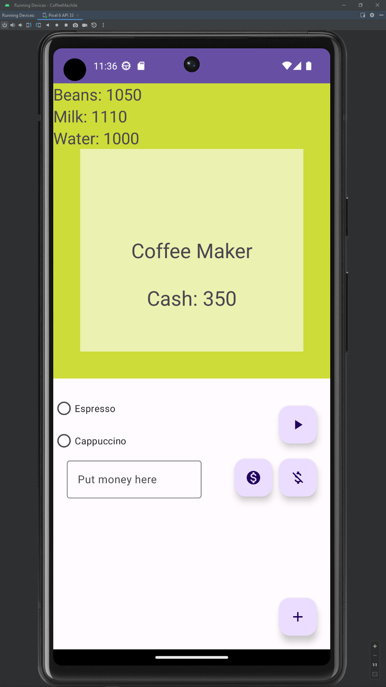

# Coffee machine.

Лабораторная работа по созданию приложения, которое имитирует работу кофемашины.

## Экраны.

|  |  |
|:-------------------------------|--------------------------------:|
| Экран кофемашины               |       Экран добавления ресурсов |

## Использование приложения.

### Добавление ресурсов.

При попытке добавить пустые поля ресурсов, ничего не будет происходить. Если же хоть в одном поле
будет какое-нибудь значение, то к этому ресурсу добавятся значения поля этого ресурса.

### Работа кофемашины.

Если не выбрать тип кофе, который хочет сварить пользователь, покажется предупреждение. После выбора
кофе и начала работы кофемашины, будет показываться состояние приготовления кофе.

## Использованные технологии.

- [Cicerone](https://github.com/terrakok/Cicerone) для навигации в приложении;
- [MVVM](https://habr.com/ru/companies/dataart/articles/272737/) в качестве архитектуры приложения;
- [Kotlin Coroutines](https://developer.android.com/kotlin/coroutines) для многопоточности;
- [Koin](https://insert-koin.io/) для внедрения [зависимостей](https://habr.com/ru/articles/350068/).
